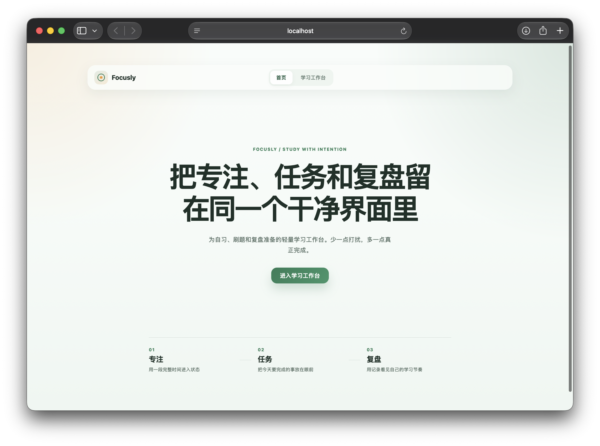
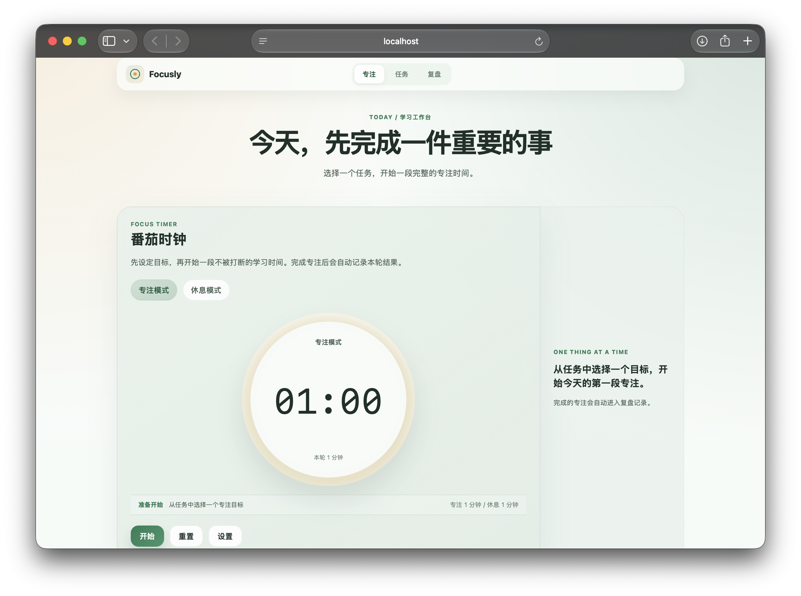
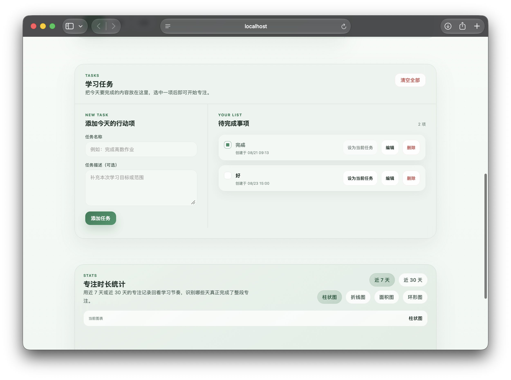

# Focusly

Focusly 是一个面向自习、刷题与复盘的轻量学习工作台，包含番茄计时、学习任务、专注记录与统计图表。项目在远端 API 可用时优先同步数据；网络不可用或请求超时时，任务、配置和打卡记录会使用 LocalStorage 兜底，并将可重试写操作放入 pending 队列。

## 界面预览







## 技术栈

- Vue 3 Composition API
- Vite 5
- Axios
- ECharts 5（按需注册，统计图异步加载）
- LocalStorage

运行环境要求：Node.js 18 或更高版本。

## 安装和运行

```bash
npm install
npm run dev
```

开发服务器启动后，按终端输出的本地地址访问应用。

```bash
npm run build
npm run preview
```

`npm run build` 生成生产产物到 `dist/`；`npm run preview` 用于本地预览生产构建。

## 目录结构

```text
src/
├── App.vue                    # 页面状态与交互编排
├── main.js                    # Vue 应用入口
├── components/
│   └── StatsChart.vue          # 异步加载的 ECharts 统计图
├── composables/
│   └── useTimer.js             # 基于绝对 deadline 的计时逻辑
├── services/
│   ├── api.js                  # API、缓存镜像、fallback 与 pending 重放
│   ├── storage.js              # LocalStorage 安全读写
│   └── stats.js                # 远端统计与本地 session 聚合
├── styles/
│   └── main.css                # 全局样式和响应式断点
└── utils/
    └── date.js                 # 日期工具

docs/
└── apifox-api-setup.md         # Apifox 接口与 Mock 配置说明
```

## Apifox 环境变量

复制 `.env.example` 为 `.env.local`，再填写实际接口地址：

```dotenv
VITE_API_BASE_URL=https://your-mock-domain.example.com/api
VITE_API_TIMEOUT=5000
```

`VITE_API_BASE_URL` 必须与接口路径的 `/api` 前缀只出现一次。当前请求路径以 `/timer`、`/task`、`/clock`、`/stat` 开头，因此：

- Mock 地址已包含 `/api` 时，填写 `https://host/api`。
- Mock 地址不包含 `/api` 时，填写 `https://host`，并相应调整服务端代理或接口基础路径。
- 仅使用本地兜底时，可保持 `.env.example` 的 `/api`；请求失败后会读取本地快照。

详见 [Apifox 配置说明](docs/apifox-api-setup.md)。

## LocalStorage 数据项

所有数据使用 `focusly:` 前缀：

| Key | 用途 |
| --- | --- |
| `focusly:config` | 番茄时长配置：`studyDuration`、`restDuration` |
| `focusly:tasks` | 学习任务列表 |
| `focusly:clocks` | 按本地自然日去重的每日打卡记录 |
| `focusly:sessions` | 原始专注 session，用于本地统计聚合 |
| `focusly:pending` | 网络失败时等待重放的任务、配置和 clock 写操作，最多 100 条 |
| `focusly:stats-week` | 周统计远端快照 |
| `focusly:stats-month` | 月统计远端快照 |

读取损坏 JSON 或 LocalStorage 不可用时，存储服务会返回安全默认值，避免页面初始化失败。

## 数据同步策略

- GET 成功时，将可信远端数据镜像到 LocalStorage。
- GET 失败、超时或 Mock 不可用时，返回对应本地快照。
- 写操作失败时，先应用本地结果，再将可重试操作加入 `focusly:pending`。
- 网络恢复或页面初始化时，pending 按顺序重放；只有同步成功的操作会从队列移除。
- 对应资源存在 pending 时，不使用旧的远端 GET 覆盖本地修改。
- session 当前是本地原始记录，不进入 pending 队列；统计 fallback 基于 session 聚合。

## 构建命令

```bash
npm run build
```

统计图使用异步组件分包，ECharts 不会进入首页首屏主脚本。首次进入工作台并渲染复盘图表时，浏览器会再加载图表 chunk。

## 已知限制

- 普通 Apifox 静态 Mock 通常不会跨请求持久化 CRUD 状态；需要状态化 Mock、本地 Mock Server 或真实后端才能验证完整远端写入流程。
- session 目前只保存在本地，未配置远端 session 写入接口。
- pending 队列适用于配置、任务和 clock 写操作；若浏览器禁止或无法写入 LocalStorage，离线修改无法跨刷新保留。
- 图表依赖 ECharts，统计图异步 chunk 仍较大，但不会占用首页首屏资源。
